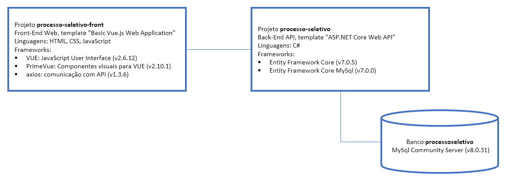

# processo-seletivo
Aplicação de avaliação ténica para o cargo de desenvolvedor C# na Hepta.

O teste foi feito com uma arquitetura simplificada para facilitar o entendimento. A aplicação é um back-end api para visualização e gerenciamento (CRUD) em uma listagem de funcionários armazenada em banco de dados:

# Guia de Como Executar a Aplicação e Testes unitários
Este guia descreve os passos necessários para executar a aplicação ASP.NET Core "processo-seletivo". Certifique-se de ter cumprido todos os requisitos antes de começar.

## Requisitos de Software
Antes de prosseguir com a execução da aplicação, verifique se você possui os seguintes pré-requisitos de software instalados:

Visual Studio 2022: Um ambiente de desenvolvimento integrado (IDE) para o desenvolvimento de aplicativos ASP.NET Core. Você pode baixar o Visual Studio 2022 Community gratuitamente em https://visualstudio.microsoft.com/pt-br/vs/community/.

MySQL Server: Um sistema de gerenciamento de banco de dados relacional. Você pode baixar o MySQL Server em https://dev.mysql.com/downloads/mysql/ e seguir as instruções de instalação fornecidas.

## Configuração
As etapas de configuração são as seguintes:

Clone este repositório para o seu ambiente local:

git clone https://github.com/Alexlr10/Processo-Seletivo-Hepta-back.git

Abra o projeto "processo-seletivo.sln" no Visual Studio 2022.

No arquivo ".env" na raiz do projeto, atualize as seguintes variáveis de ambiente com as credenciais de acesso ao banco de dados mysql:

DB_SERVER=nome_do_servidor

DB_DATABASE=nome_do_banco_de_dados

DB_USER=nome_do_usuario

DB_PASSWORD=senha_do_usuario

## Executando a Aplicação

No Visual Studio 2022, certifique-se de ter selecionado o projeto "processo-seletivo" como projeto de inicialização.

Pressione F5 ou clique em "Iniciar Depuração" para iniciar a aplicação.

A aplicação será executada e estará acessível em https://localhost:7046.

Para interagir com a API, você pode usar o Swagger. Acesse https://localhost:7046/swagger para abrir a interface do Swagger, onde você encontrará a documentação das rotas disponíveis e poderá testá-las.

## Testando o ambiente de desenvolvimento
Executar ("Start Without Debugging") o projeto da API. Usar a interface Swagger para executar os endpoints /api/Status/servidorweb e /api/Status/bancodados. O retorno de ambos deve ser HTTP 200 ("API operacional" e "BD operacional").

Algumas sugestões em caso de erro:

Credenciais de acesso ao MySql estão corretas?

Nome do banco de dados está correto? ("processoseletivo")

O restore foi feito no banco correto?

Se o MySql está remoto (não está em localhost) o usuário sendo usado para acesso ao banco deve ser configurado para acesso remoto.

Executar ("Start Without Debugging") o projeto do front-end. A tela inicial "Funcionários" deve ser mostrada, listando os registros cadastrados em banco.

## Executando os Testes Unitários
O projeto "test-processo-seletivo" contém os testes unitários para a aplicação. Para executá-los, siga as etapas abaixo:

Abra o projeto "test-processo-seletivo" no Visual Studio 2022.

Certifique-se de ter selecionado o projeto "test-processo-seletivo" como projeto de inicialização.

No menu "Teste", clique em "Executar" e selecione "Todos os Testes" para executar todos os testes unitários.

Os resultados dos testes serão exibidos no "Gerenciador de Testes" no Visual Studio.

Após seguir essas etapas, você terá a aplicação ASP.NET Core "processo-seletivo" em execução, juntamente com os testes unitários sendo executados para validar o seu funcionamento.